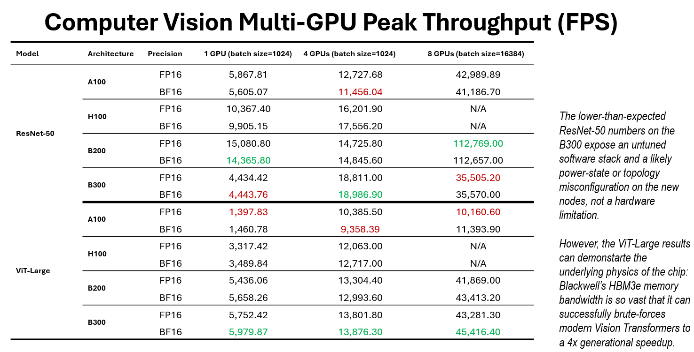
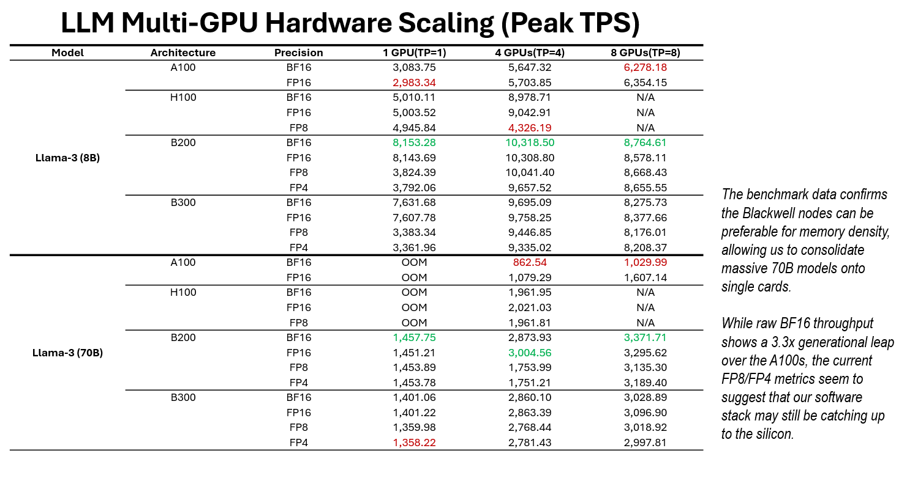

# GPUBenchmarking

A suite of benchmarking scripts designed to evaluate Computer Vision (CV) and Large Language Model (LLM) performance across different NVIDIA GPU architectures (A100, H100, B200, B300) and precisions (BF16, FP16, FP8, FP4).

## Project Structure

* `run_bench.sh`: Slurm orchestration script for automated benchmarking across different partitions.
* `cv.py`: Benchmarking script for Torchvision models (e.g., ResNet50, ViT) focusing on FPS and latency.
* `llm.py`: LLM inference benchmarking using `vLLM`, supporting various quantization types and tracking TPS and TTFT.
* `vis.py`: Data visualization script to generate comparative analysis charts and efficiency frontiers.

## Features

- **Multi-Precision Support:** Benchmarks performance for `bf16`, `fp16`, and next-gen `fp8` and `fp4` (simulated/headroom-adjusted).
- **Architecture Aware:** Custom configurations for NVIDIA Blackwell (B200/B300), Hopper (H100), and Ampere (A100) architectures.
- **Automated Logging:** Results are automatically saved to CSV files (`cv_benchmark_results_1.csv`, `llm_benchmark_results_1.csv`).
- **Visual Analytics:** Generates "Efficiency Frontier" scatter plots to visualize the trade-off between throughput and latency.

## Setup & Usage

### Prerequisites
- Python 3.11+
- CUDA 13.0+
- PyTorch & vLLM
- Slurm Workload Manager

### Running Benchmarks
To submit a benchmark job to a Slurm cluster:
```bash
sbatch --partition=h100 --gres=gpu:4 run_bench.sh
```

## Benchmark Results

Below are the summarized performance metrics across different GPU architectures and precisions.

### Computer Vision Performance
The following table illustrates the throughput (FPS) and efficiency for standard CV models like ResNet50 and ViT.



*Table 1: CV Performance across A100, H100, and Blackwell architectures.*

---

### LLM Inference Performance
The following table highlights the Tokens Per Second (TPS) and Time To First Token (TTFT) for Llama-3 models.



*Table 2: LLM throughput and latency metrics focusing on FP8 and FP4 precision gains.*