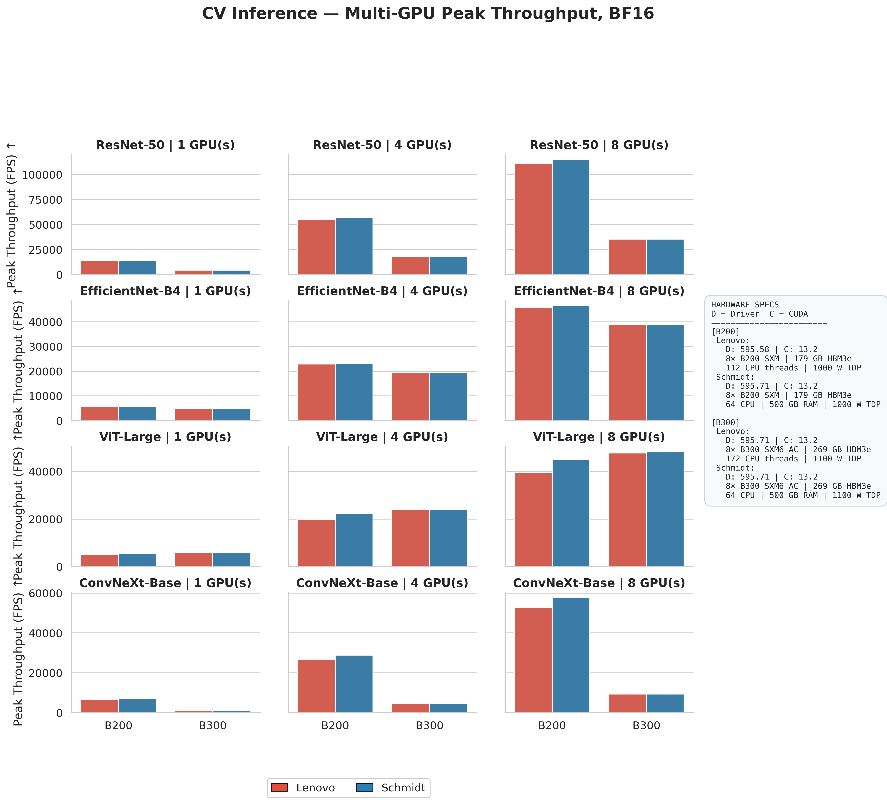
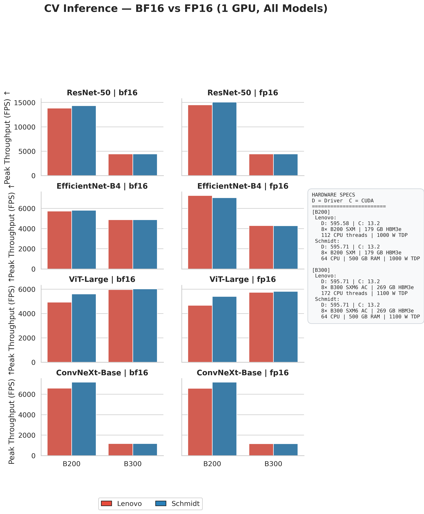
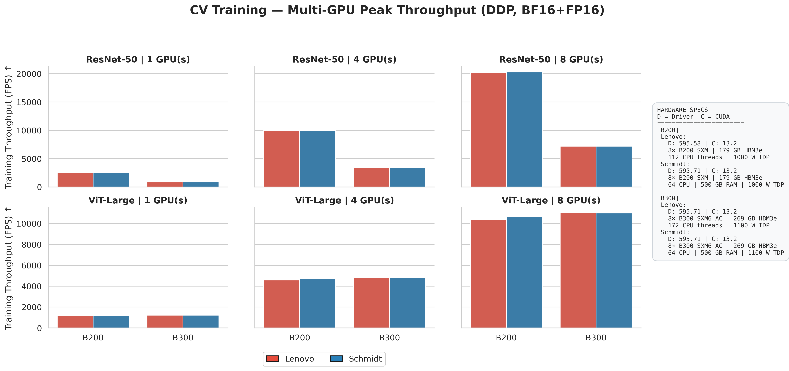
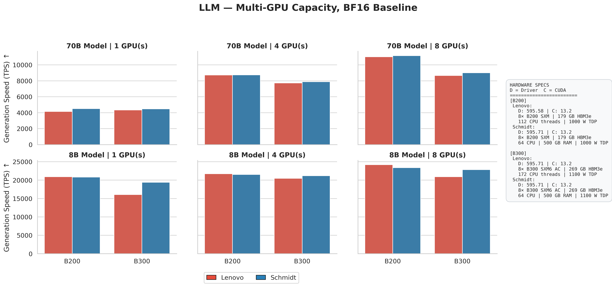
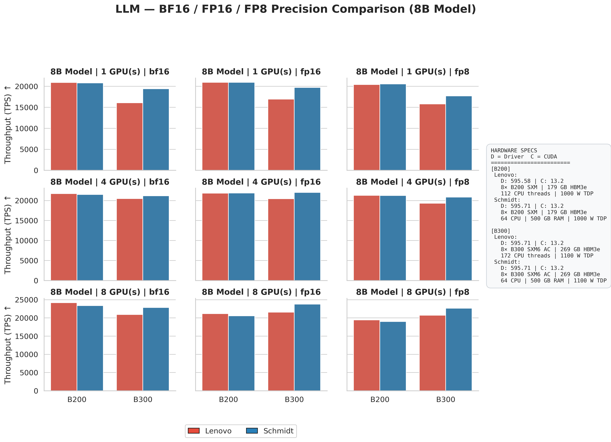
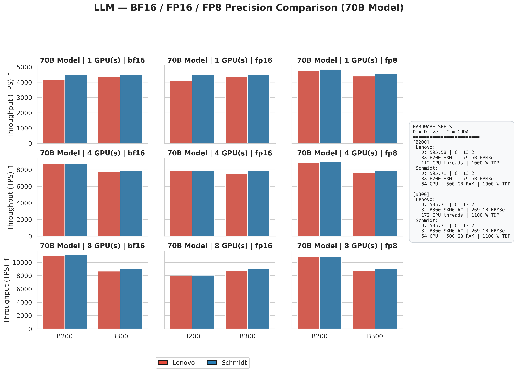
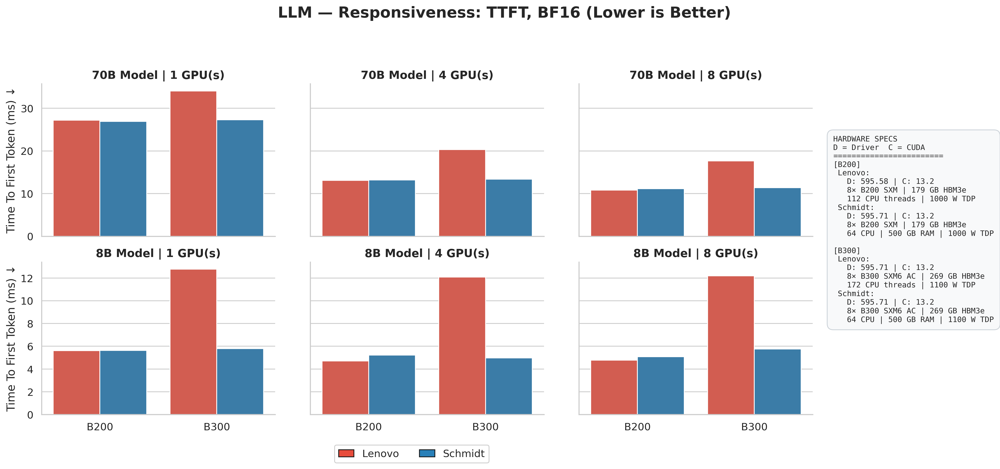

# GPU Benchmark Suite — NVIDIA B200 & B300

A benchmark suite for evaluating **Computer Vision** (inference + DDP training) and **LLM inference** performance on NVIDIA Blackwell GPUs, across multiple precisions and GPU counts. Results cover two clusters running 8× B200 SXM and 8× B300 SXM6 AC nodes.

---

## Repository Structure

```
.
├── src/
│   ├── cv.py                      # CV inference & DDP training benchmark
│   ├── llm.py                     # LLM inference benchmark (vLLM)
│   └── vis.py    # Visualization — generates all figures
├── run_bench.sh                   # Slurm job script (Slurm-managed clusters)
├── results/
│   ├── cv_benchmark_results_*.csv
│   ├── cv_train_benchmark_results_*.csv
│   └── llm_benchmark_results_*.csv
├── figures/           # Generated figures (PNG)
└── logs/                          # nvidia-smi specs and benchmark run logs
```

---

## What is Benchmarked

### Computer Vision (`src/cv.py`)

| | Details |
|---|---|
| **Mode** | Inference · DDP Training |
| **Models** | ResNet-50 · EfficientNet-B4 · ViT-Large · ConvNeXt-Base (inference); ResNet-50 · ViT-Large (training) |
| **Precisions** | BF16 · FP16 |
| **GPU counts** | 1 · 4 · 8 |
| **Batch sizes** | 64–8192 (inference) · 64–4096 (training) |
| **Metrics** | Throughput (FPS · img/s) · Latency (ms) · Energy efficiency (img/W) · VRAM (GB) |

### LLM Inference (`src/llm.py`)

| | Details |
|---|---|
| **Framework** | vLLM (tensor parallelism) |
| **Models** | Llama-3-8B · Llama-3-70B |
| **Precisions** | BF16 · FP16 · FP8 (B200/B300 only) |
| **GPU counts** | 1 · 4 · 8 (tensor parallel) |
| **Note** | 70B on 1 GPU requires ≥179 GB VRAM (B200/B300 only) |
| **Metrics** | Throughput (tok/s) · Avg latency (ms) · TTFT (ms) · VRAM utilization |

> **FP4**: NV-FP4 LLM inference requires pre-quantized checkpoints. Standard Llama-3 HuggingFace weights were quantized with NVIDIA modelopt 0.44.0, but the resulting checkpoint has a format mismatch with the validated vLLM versions on these clusters. FP4 results will be added once a compatible release is available.

---

## Hardware

| Cluster | GPU | VRAM | TDP | Driver | CUDA |
|---------|-----|------|-----|--------|------|
| Lenovo  | 8× B200 SXM | 179 GB HBM3e | 1000 W | 595.58 | 13.2 |
| Lenovo  | 8× B300 SXM6 AC | 269 GB HBM3e | 1100 W | 595.71 | 13.2 |
| Schmidt | 8× B200 SXM | 179 GB HBM3e | 1000 W | 595.71 | 13.2 |
| Schmidt | 8× B300 SXM6 AC | 269 GB HBM3e | 1100 W | 595.71 | 13.2 |

---

## Prerequisites

- Python 3.11+
- CUDA 13.x
- PyTorch (with torchvision)
- [vLLM](https://github.com/vllm-project/vllm) — for B300 FP8, must be built from source with `TORCH_CUDA_ARCH_LIST='10.3'`
- `pynvml`, `matplotlib`, `pandas`, `python-pptx`

```bash
pip install torch torchvision vllm pynvml matplotlib pandas python-pptx
```

---

## Running the Benchmarks

### Slurm cluster (`run_bench.sh`)

The script auto-detects the GPU type from `nvidia-smi` and sets the appropriate tag (`b200`, `b300`, `h100`, etc.).

```bash
# B200 node, all 8 GPUs
sbatch --partition=b200 --gres=gpu:8 run_bench.sh

# B300 node, all 8 GPUs
sbatch --partition=b300 --gres=gpu:8 run_bench.sh

# Partial GPU allocation
sbatch --partition=b200 --gres=gpu:4 run_bench.sh
```

Outputs go to `results/cv_benchmark_results_1.csv`, `results/cv_train_benchmark_results_1.csv`, and `results/llm_benchmark_results_1.csv`. Rename and copy to the `results/` folder with a cluster-identifying suffix (e.g., `_lenovo`, `_schmidt`).


### Running scripts directly

```bash
# CV inference — 8 GPUs, BF16
torchrun --standalone --nproc_per_node=8 src/cv.py \
    --models resnet50,efficientnet_b4,vit_l_16,convnext_base \
    --batch_sizes 1024,4096,8192 --tag b200_8g --dtype bf16 --mode inference

# CV training — 8 GPUs, FP16
torchrun --standalone --nproc_per_node=8 src/cv.py \
    --models resnet50,vit_l_16 \
    --batch_sizes 1024,4096 --tag b200_8g --dtype fp16 --mode train

# LLM inference — Llama-3-70B, FP8, tensor parallel 8
python src/llm.py --model models/Llama-3-70B --tp 8 --dtype fp8 --tag b200_70b_8g
```

### Generating figures

```bash
cd Benchmarks/
python src/vis.py
# Saves 10 PNGs to figures/
```

---

## Results

All four hardware configurations are shown in each figure (Lenovo B200, Schmidt B200, Lenovo B300, Schmidt B300).

### CV Inference — Multi-GPU Scaling (BF16)



- **B200** dominates ResNet-50, reaching ~111–115K FPS at 8 GPUs.
- **B300** leads ViT-Large at 8 GPUs (~48K vs ~40–45K FPS for B200), reflecting its higher HBM3e bandwidth per GPU benefiting attention-heavy workloads.
- **ConvNeXt-Base on B300** shows an anomalous throughput collapse (~9K vs ~53–58K FPS on B200) due to a CPU data-pipeline bottleneck from high-frequency depthwise convolutions.

### CV Inference — BF16 vs FP16



- BF16 and FP16 deliver nearly identical throughput (within 2–4%) for all models on both GPUs — both precisions share the same tensor core throughput on B200/B300.

### CV Training — Multi-GPU Scaling (DDP)



- B200 reaches ~20K img/s for ResNet-50 DDP at 8 GPUs; B300 peaks at ~7.2K img/s — the same CPU data-pipeline bottleneck that limits CNN inference also limits training.
- ViT-Large training is faster on B300 (~11K img/s at 8 GPUs) than B200 (~10–10.7K), confirming the bottleneck is CNN-specific.
- Lenovo and Schmidt show nearly identical DDP throughput for each GPU type.

### LLM — Multi-GPU Capacity (BF16)



- **8B model:** B200 and Schmidt B300 are within ~2% at 8 GPUs (~22.9K vs 23.4K TPS). Lenovo B300 trails by ~14% (20.9K vs 24.2K), attributed to the vLLM dev build used on that cluster being less optimized for sm_103.
- **70B model:** B200 outperforms B300 by ~24–27% at 8 GPUs (11.0–11.2K vs 8.7–9.0K TPS). Scaling from 1→8 GPUs is ~2.5× for B200.

### LLM — Precision Comparison, 8B Model



- On B200, BF16 leads at 8 GPUs (~23–24K TPS). On B300, FP16 edges out BF16 (Schmidt: 23.8K vs 22.9K; Lenovo: 21.6K vs 20.9K).
- FP8 on Schmidt B300 outperforms Schmidt B200 FP8 by +19% (22.7K vs 19.0K). The advantage is smaller on Lenovo (+7%), reflecting the partially optimized sm_103 FP8 kernels in the dev build.

### LLM — Precision Comparison, 70B Model



- On B200, FP8 meaningfully outperforms FP16 at 8 GPUs (+34–36%: ~10.9K vs ~8.0K TPS); the 70B model is memory-bandwidth bottlenecked and benefits from reduced data movement.
- On B300, all three precisions deliver nearly equal 70B throughput (~8.7–9.0K TPS) — B300's wider memory bus is already saturated in BF16/FP16.

### LLM — Time to First Token (TTFT, BF16)



- B200 and Schmidt B300: 70B TTFT halves from ~27ms at 1 GPU to ~11ms at 8 GPUs; 8B stays flat at ~5ms confirming clean tensor-parallel scaling of the prefill GEMM.
- Lenovo B300 shows anomalously high TTFT (~12–13ms for 8B, ~18ms for 70B at 8 GPUs) — ~2.1–2.2× higher than Schmidt B300 despite identical hardware, due to less optimized CUDA graph compilation for sm_103 in the vLLM dev build. The sub-10ms (8B) / sub-15ms (70B at ≥4 GPUs) target is met by B200 and Schmidt B300 but not yet by Lenovo B300.
